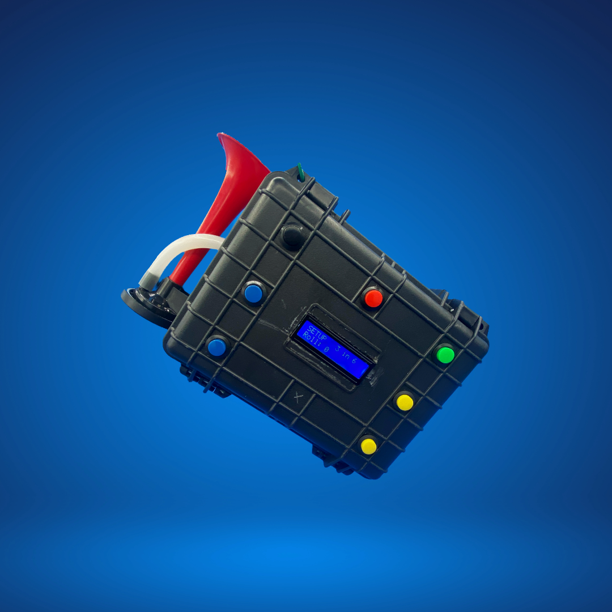

# Computerized Starting Horn Box for Sailing Races

## Overview

The Computerized Starting Horn Box project is a hardware and software solution designed improve the efficiency of starting signals for sailing races. This project aims to improve traditional starting horn boxes with a computerized system that offers several advantages, including ease of use and reliability.

## Features

- **Precision Timing:** The system uses advanced timing mechanisms to ensure precise starting signals, reducing the likelihood of false starts and providing a fairer race environment.

- **Automated Countdown:** The system includes a countdown feature that eliminates the need for a dedicated timer, ensuring synchronized countdowns for all participants.

- **Remote Control:** Operators can remotely trigger the starting signals, allowing for flexibility and adaptability during race preparations.

- **User-Friendly Interface:** The intuitive user interface simplifies system operation, making it accessible to both experienced and novice users.

## Hardware Components

- **Microcontroller:** A powerful microcontroller serves as the brains of the system, handling timing and signal generation.

- **Horn Speaker:** A high-quality horn speaker delivers clear and audible signals to all participants.

- **User Interface:** A user-friendly interface, which can be accessed through a touchscreen or remote control, provides control over the system.

- **Power Supply:** The system is designed to work with various power sources, including battery packs and shore power.

## Software Components

- **Timing Algorithm:** The software includes a precise timing algorithm that ensures accurate countdowns and starting signals.

- **Signal Configuration:** Users can easily configure the horn signals and countdown settings through the software interface.

## Getting Started

To get started with the Computerized Starting Horn Box, please refer to the detailed installation and setup instructions in the documentation. The project also includes sample code for customization and integration with other race management tools.

## Contributing

We welcome contributions from the sailing community and developers interested in improving this project. Please send me an email below if you are interested in contributing to this project.

## License

This project is open-source and released under the [MIT License](LICENSE.md).

## Contact

If you have any questions, feedback, or encounter issues with the Computerized Starting Horn Box, please reach out to the project maintainers at [noahro at BU.edu](mailto:noahro@email.com).

---

